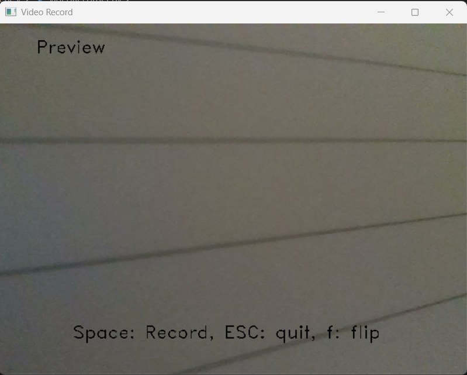

# video_recorder_OpenCV
Simple Video Recorder with OpenCV

## OpenCV를 사용한 간단한 비디오 녹화기입니다.
* VideoCapture를 사용해서 웹캠으로 녹화합니다.
* VideoWriter를 사용해서 avi파일로 영상을 저장합니다.
## 기능 설명
* Space 키에 모드 변환
* ESC 키에 프로그램 종료
* f 키에 좌우 반전
